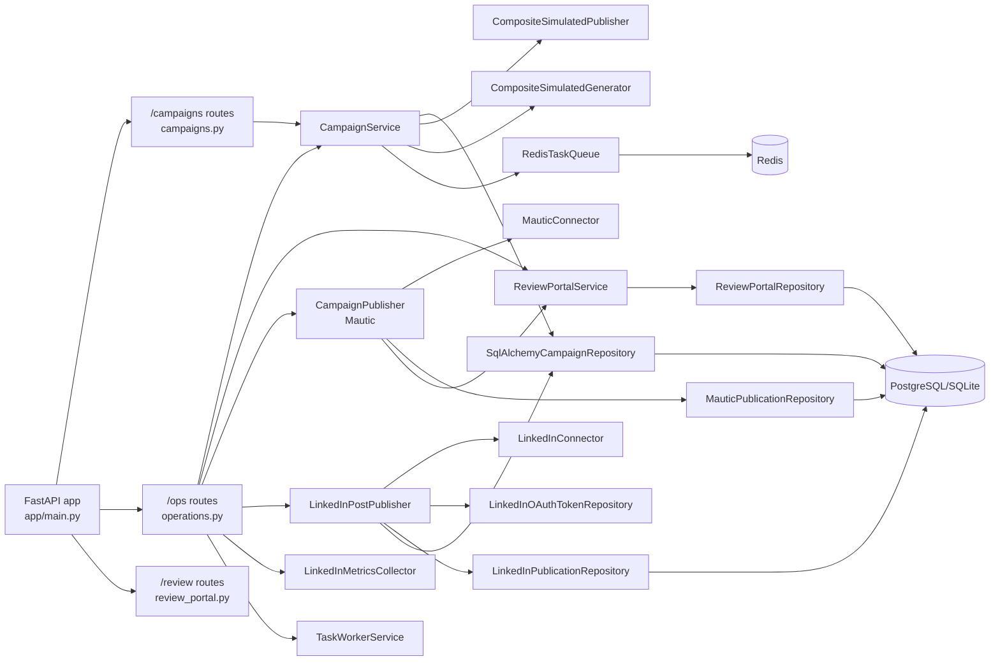
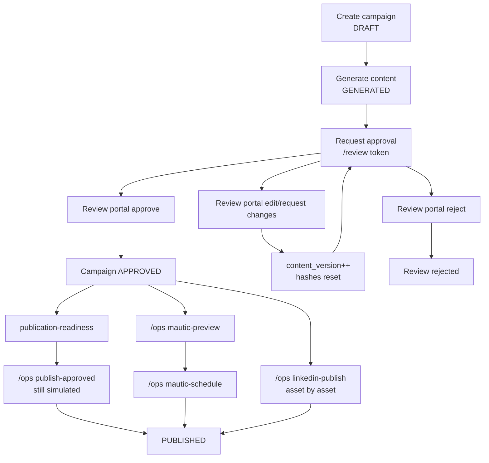

# Current Growth Architecture

Date d'audit: 2026-07-11
Branche: `feature/MGF-200-current-state-audit`

## Perimetre inspecte

Analyse fondee sur le code et la config reels dans :

- `app/domain/entities.py`
- `app/domain/enums.py`
- `app/domain/errors.py`
- `app/application/ports/connectors.py`
- `app/application/services/campaign_service.py`
- `app/application/services/campaign_publisher.py`
- `app/application/services/review_portal_service.py`
- `app/application/services/multichannel_content_service.py`
- `app/application/services/linkedin_post_publisher.py`
- `app/application/services/linkedin_oauth_service.py`
- `app/application/services/linkedin_organization_resolver.py`
- `app/application/services/linkedin_metrics_collector.py`
- `app/application/services/task_worker_service.py`
- `app/entrypoints/api/routes/campaigns.py`
- `app/entrypoints/api/routes/operations.py`
- `app/entrypoints/api/routes/review_portal.py`
- `app/entrypoints/api/dependencies.py`
- `app/entrypoints/api/schemas.py`
- `app/infrastructure/connectors/fakes.py`
- `app/infrastructure/connectors/linkedin.py`
- `app/infrastructure/connectors/mautic.py`
- `app/infrastructure/repositories/campaigns.py`
- `app/infrastructure/repositories/review_portal.py`
- `app/infrastructure/repositories/idempotency.py`
- `app/infrastructure/repositories/mautic_publications.py`
- `app/infrastructure/repositories/linkedin.py`
- `app/infrastructure/db/models.py`
- `app/infrastructure/tasks.py`
- `app/main.py`
- `app/worker.py`
- `alembic/versions/*.py`
- `docker-compose.yml`
- `docker-compose.ovh.yml`
- `Dockerfile`
- `deploy/ovh.env.example`
- `n8n/workflows/*.json`
- `tests/**/*.py`

## Architecture actuelle

Le socle expose deux mecanismes de publication differents :

- publication generique de campagne via `CampaignService.publish()` et `PublisherPort` dans `app/application/services/campaign_service.py` et `app/application/ports/connectors.py`;
- publication specialisee par canal via routes `/ops/*`, en particulier Mautic dans `app/application/services/campaign_publisher.py` et LinkedIn dans `app/application/services/linkedin_post_publisher.py`.

Point cle: la route generique `POST /campaigns/{id}/publish` et la route ops `POST /ops/campaigns/{id}/publish-approved` restent branchees sur des publishers simules via `CompositeSimulatedPublisher` dans `app/entrypoints/api/dependencies.py`. Le code LinkedIn "reel" existe deja, mais il n'est pas branche sur `PublisherPort`.

### Diagramme composants

## Workflow campagne

### Etats et transitions

Les etats reels sont definis dans `app/domain/enums.py` :

- `DRAFT`
- `GENERATED`
- `CHANGES_REQUESTED`
- `APPROVED`
- `REJECTED`
- `PUBLISHED`

Les transitions sont implementees dans `app/domain/entities.py` :

- `mark_generated()` : `DRAFT|CHANGES_REQUESTED -> GENERATED`
- `request_changes()` : `GENERATED|APPROVED -> CHANGES_REQUESTED`
- `approve()` : `GENERATED|CHANGES_REQUESTED -> APPROVED`
- `reject()` : `GENERATED|CHANGES_REQUESTED|APPROVED -> REJECTED`
- `publish()` : `APPROVED|PUBLISHED -> PUBLISHED`

### Diagramme workflow

## Modeles inspectes

### Campagne

`CampaignRun` dans `app/domain/entities.py` contient :

- metadata campagne : `id`, `name`, `objective`, `status`;
- collections metier : `editorial_briefs`, `content_assets`, `audience_segments`, `approval_decisions`, `publications`, `interactions`, `leads`, `source_evidences`.

Persistance correspondante dans `app/infrastructure/db/models.py` :

- `campaign_runs`
- `editorial_briefs`
- `content_assets`
- `audience_segments`
- `approval_decisions`
- `publications`
- `interactions`
- `leads`
- `source_evidences`

### Assets

`ContentAsset` dans `app/domain/entities.py` persiste deja les champs utiles au remplacement des publishers simules :

- `asset_type`
- `channel`
- `title`
- `body`
- `evidence_ids`
- `audience_segment_id`
- `status`
- `content_hash`
- `approved_by`
- `approved_at`
- `scheduled_at`
- `results`
- `revision`

Canaux reels observes :

- `linkedin`
- `oling`
- `mautic`

Mapping asset type -> canal dans `app/application/services/multichannel_content_service.py` :

- `customer_email` -> `mautic`
- `prospect_newsletter` -> `mautic`
- `linkedin_company_post` -> `linkedin`
- `linkedin_personal_draft` -> `linkedin`
- `website_article` -> `oling`
- `website_cta` -> `oling`
- `demonstration_landing_page` -> `oling`

## Publishers actuels

### Interface commune

L'interface commune reelle est `PublisherPort.publish(self, campaign: CampaignRun, channel: str) -> Publication` dans `app/application/ports/connectors.py`.

Sous-interfaces presentes :

- `LinkedInConnectorPort`
- `OlingSiteConnectorPort`

### Implementations simulees branchees en production applicative

Dans `app/infrastructure/connectors/fakes.py` :

- `SimulatedLinkedInConnector`
- `SimulatedOlingSiteConnector`
- `CompositeSimulatedPublisher`

Dans `app/entrypoints/api/dependencies.py`, `get_campaign_service()` instancie `CompositeSimulatedPublisher` avec :

- `linkedin` -> `SimulatedLinkedInConnector`
- `oling` -> `SimulatedOlingSiteConnector`

Effet actuel :

- `POST /campaigns/{id}/publish` publie des `Publication.external_reference` de forme `linkedin:{campaign.id}` ou `oling:{campaign.id}`;
- `POST /ops/campaigns/{id}/publish-approved` appelle le meme `CampaignService.publish()` et reste donc simule pour `linkedin` et `oling`.

### Implementations specialisees hors interface commune

Le depot contient aussi des services canal-specifiques non branches sur `PublisherPort` :

- `CampaignPublisher` pour Mautic dans `app/application/services/campaign_publisher.py`;
- `LinkedInPostPublisher` pour LinkedIn dans `app/application/services/linkedin_post_publisher.py`.

Conclusion d'audit :

- Mautic n'utilise pas `PublisherPort`;
- LinkedIn "reel" n'utilise pas `PublisherPort`;
- aucun connecteur Oling reel n'existe dans le depot;
- le point d'extension principal a migrer est `get_campaign_service()` dans `app/entrypoints/api/dependencies.py`.

## Connecteurs presents et connecteurs a ajouter

### Connecteurs presents

- `app/infrastructure/connectors/mautic.py`
- `app/infrastructure/connectors/linkedin.py`
- `app/infrastructure/connectors/github.py`
- `app/infrastructure/connectors/mapsi_usage.py`
- `app/infrastructure/connectors/fakes.py`

### Connecteurs a ajouter pour remplacer les publishers simules

Connecteurs absents du depot a la date de l'audit :

- un connecteur Oling reel pour le canal `oling`;
- un branchement de la publication LinkedIn reelle sur l'interface commune `PublisherPort`;
- un branchement de la publication Oling reelle sur l'interface commune `PublisherPort`;
- une configuration explicite par canal pour choisir simulateur vs reel dans `get_campaign_service()`.

## Publication-readiness

Le mecanisme est implemente dans `app/application/services/review_portal_service.py` et expose par `GET /ops/campaigns/{campaign_id}/publication-readiness` dans `app/entrypoints/api/routes/operations.py`.

Criteres reels :

- campagne en `APPROVED`;
- review portal en statut `approved`;
- `approved_content_hash == content_hash(review)`;
- `approved_audience_hash == audience_hash(review)`;
- `scheduled_at` absent ou futur;
- `WORKFLOW_KILL_SWITCH` desactive.

Limites actuelles :

- le readiness check ne regarde pas les kill switches par instance/client;
- le readiness check ne regarde aucun kill switch par canal, car aucun n'existe;
- le readiness check ne verifie pas la disponibilite d'un token LinkedIn ni d'un connecteur Oling reel.

## content_hash et audience_hash

### content_hash des assets

Calcule dans :

- `app/domain/entities.py::build_content_hash()`
- `app/application/services/multichannel_content_service.py::_content_hash()`

Payload hashé :

- `asset_type`
- `title`
- `body`
- `evidence_ids`
- `audience_segment_id`

Stockage :

- `content_assets.content_hash`
- `linkedin_publications.content_hash`

### content_hash et audience_hash du review portal

Calcules dans `app/application/services/review_portal_service.py` :

- `content_hash(review)` sur `theme`, `objective`, `email_subject`, `email_preheader`, `email_html`, `email_text`, `content_version`;
- `audience_hash(review)` sur `segment_id`, `segment_label`, `segment_version`, `audience_volume`, `exclusions`.

Stockage :

- `campaign_reviews.approved_content_hash`
- `campaign_reviews.approved_audience_hash`

## Mecanismes d'idempotence

### API HTTP

Routes `POST /campaigns*` et `POST /ops/*` :

- implementation dans `app/entrypoints/api/idempotency.py`;
- stockage dans `idempotency_keys` via `app/infrastructure/repositories/idempotency.py`;
- unicite par `method + path + idempotency_key`;
- verification supplementaire par `request_fingerprint`.

### Publication campagne generique

Dans `CampaignRun.publish()` dans `app/domain/entities.py` :

- publication d'un canal deja present ignoree silencieusement;
- idempotence seulement par `channel`.

### GitHub webhook

Dans `app/infrastructure/db/models.py` :

- `webhook_deliveries.delivery_id` est unique.

### Mautic

Dans `app/infrastructure/db/models.py` :

- unicite `campaign_run_id + content_version + segment_version` sur `mautic_campaign_publications`.

Dans `app/application/services/campaign_publisher.py` :

- une version deja `scheduled` declenche `DuplicateCampaignPublicationError`;
- `idempotency_key` est stocke mais n'est pas la cle d'unicite principale.

### LinkedIn

Dans `app/infrastructure/db/models.py` :

- unicite `content_asset_id + content_hash` sur `linkedin_publications`.

Dans `app/application/services/linkedin_post_publisher.py` :

- si meme asset+hash deja `published` ou `manual_copy`, la reponse est rejouee;
- si la publication existe deja avec une autre `Idempotency-Key`, erreur `DuplicateCampaignPublicationError`.

## Stockage des external publication IDs

Stockages reels observes :

- publication generique simulee : `publications.external_reference`;
- Mautic : `mautic_campaign_publications.mautic_email_id`, `mautic_segment_id`, `mautic_campaign_id`;
- LinkedIn : `linkedin_publications.organization_urn`, `linkedin_post_urn`;
- copie de confort sur asset LinkedIn : `content_assets.results["linkedin_post_urn"]`;
- metriques LinkedIn : `content_assets.results["linkedin_metrics"]`.

## Gestion des erreurs partielles

### Ce qui existe

- mapping d'erreurs domaine -> HTTP dans `campaigns.py`, `operations.py`, `review_portal.py`;
- exceptions externes `ExternalConnectorError` et `RateLimitExceededError` dans `app/domain/errors.py`;
- persistance d'un `last_error` sur `mautic_campaign_publications` et `linkedin_publications`.

### Ce qui manque

- pas de transaction multi-canal avec compensation dans `CampaignService.publish()` : la boucle publie canal par canal, puis sauvegarde la campagne;
- pas de statut intermediaire "partial" au niveau campagne;
- pas de modele de retry par canal dans `campaign_runs`;
- pas de kill switch par canal;
- pas de persistance d'erreur partielle pour les publications simulees `linkedin` et `oling` via `PublisherPort`.

Risque concret :

- quand les publishers reels remplaceront les simulateurs, un premier canal pourra publier cote externe avant qu'un second canal echoue.

## Configuration des canaux

Configuration reelle observee :

- `PublishRequest` limite la route generique a `linkedin|oling` dans `app/entrypoints/api/schemas.py`;
- `PublishApprovedCampaignRequest.channels` accepte une liste libre, sans enum;
- `CHANNEL_MAP` dans `app/application/services/multichannel_content_service.py` determine le canal des assets;
- `LINKEDIN_MODE` configure le connecteur LinkedIn dans `app/core/config.py`;
- aucune variable equivalent `OLING_MODE` n'existe;
- aucune table de configuration canal n'existe;
- aucun registre central "channel -> connector strategy" n'existe en dehors du dictionnaire inline de `CompositeSimulatedPublisher`.

## Kill switch global et kill switches par canal

### Present

- kill switch global : `WORKFLOW_KILL_SWITCH` dans `app/core/config.py`;
- kill switch par instance : `PUBLICATION_INSTANCE_KILL_SWITCHES`;
- kill switch par client : `PUBLICATION_CLIENT_KILL_SWITCHES`.

Usage reel :

- `ReviewPortalService.publication_readiness()` ne verifie que `WORKFLOW_KILL_SWITCH`;
- `CampaignPublisher._enforce_kill_switches()` applique `WORKFLOW_KILL_SWITCH`, `PUBLICATION_INSTANCE_KILL_SWITCHES`, `PUBLICATION_CLIENT_KILL_SWITCHES`.

### Absent

- aucun kill switch par canal `linkedin`;
- aucun kill switch par canal `oling`;
- aucun kill switch dedie au pipeline generique `PublisherPort`.

## Taches asynchrones

Queue :

- interface `TaskQueuePort` dans `app/application/ports/tasks.py`;
- implementations `InMemoryTaskQueue` et `RedisTaskQueue` dans `app/infrastructure/tasks.py`;
- worker dans `app/worker.py`.

Jobs observes dans `CampaignService` et `TaskWorkerService` :

- `campaign.notify_created`
- `campaign.prepare_review_bundle`
- `campaign.rework_assets`
- `campaign.notify_approved`
- `campaign.archive_draft`
- `campaign.refresh_publication_metrics`
- `github.weekly_backfill`

Observation :

- plusieurs jobs restent purement trace/audit;
- `campaign.rework_assets` modifie encore le contenu de maniere artificielle en ajoutant `Reworked revision ...` dans `app/application/services/task_worker_service.py`;
- la vraie orchestration operative semble plutot portee par `n8n/workflows/*.json`.

## Routes API et portail de review

### Routes campagnes

Dans `app/entrypoints/api/routes/campaigns.py` :

- `POST /campaigns`
- `GET /campaigns`
- `GET /campaigns/{campaign_id}`
- `POST /campaigns/{campaign_id}/generate`
- `POST /campaigns/{campaign_id}/request-changes`
- `POST /campaigns/{campaign_id}/approve`
- `POST /campaigns/{campaign_id}/reject`
- `POST /campaigns/{campaign_id}/publish`

### Routes operations

Dans `app/entrypoints/api/routes/operations.py` :

- `POST /ops/collect-product-changes`
- `POST /ops/collect-mapsi-usage`
- `POST /ops/sync-mautic-contacts`
- `POST /ops/generate-weekly-campaign`
- `POST /ops/campaigns/{campaign_id}/request-approval`
- `GET /ops/campaigns/{campaign_id}/review-status`
- `GET /ops/campaigns/{campaign_id}/publication-readiness`
- `POST /ops/campaigns/{campaign_id}/publish-approved`
- `POST /ops/campaigns/{campaign_id}/mautic-preview`
- `POST /ops/campaigns/{campaign_id}/mautic-schedule`
- `GET /ops/linkedin/oauth/authorization-url`
- `POST /ops/linkedin/oauth/exchange`
- `POST /ops/campaigns/{campaign_id}/linkedin-publish`
- `POST /ops/campaigns/{campaign_id}/linkedin-metrics`
- `POST /ops/campaigns/{campaign_id}/collect-metrics`
- `POST /ops/campaigns/{campaign_id}/collect-adoption-metrics`
- `GET /ops/campaigns/{campaign_id}/adoption-report`
- `GET /ops/reports/adoption-weekly`
- `POST /ops/failure-notifications`

### Portail review

Dans `app/entrypoints/api/routes/review_portal.py` :

- `GET /review/{token}`
- `POST /review/{token}/edit`
- `POST /review/{token}/request-changes`
- `POST /review/{token}/approve`
- `POST /review/{token}/reject`
- `POST /review/{token}/revoke`

Observation :

- le portail est une page HTML inline minimale;
- aucune SPA ou template engine n'est utilisee;
- la reponse de revocation redirige vers `/campaigns`, qui renvoie une API JSON et non une page review.

## Migrations existantes

Ordre reel :

1. `20260711_0001_initial_schema.py`
2. `20260711_0002_audit_append_only.py`
3. `20260711_0003_github_product_intelligence.py`
4. `20260711_0004_mapsi_usage_collector.py`
5. `20260711_0005_audience_segmentation.py`
6. `20260711_0006_mautic_contact_sync.py`
7. `20260711_0007_editorial_agents.py`
8. `20260711_0008_review_portal.py`
9. `20260711_0009_mautic_campaign_publication.py`
10. `20260711_0010_multichannel_content_assets.py`
11. `20260711_0011_linkedin_publisher.py`

### Migrations necessaires pour la suite lot 2

Selon l'etat reel du code, les prochaines migrations probables devront au minimum couvrir :

- un stockage dedie pour les publications Oling si l'on veut une symetrie avec LinkedIn et Mautic;
- une configuration de canal persistante si le choix simulateur/reel doit devenir pilotable;
- des statuts ou journaux de publication multi-canaux si l'on veut traiter proprement les erreurs partielles;
- eventuellement des kill switches par canal si la publication reelle doit etre arretable finement.

Ces tables/colonnes n'existent pas encore dans le depot.

## Docker et deploiement

Runtime local :

- `Dockerfile` installe `.[dev]` puis lance `uvicorn`;
- `docker-compose.yml` demarre `api`, `worker`, `postgres`, `postgres_test`, `redis`.

Runtime OVH :

- `docker-compose.ovh.yml` lance `alembic upgrade head` au demarrage de `api`;
- `worker` tourne separement;
- `deploy/ovh.env.example` met `WORKFLOW_KILL_SWITCH=true` et `LINKEDIN_MODE=mock`.

Observation importante :

- le deploiement de reference reste explicitement en mode LinkedIn mock;
- aucune variable de configuration Oling n'apparait dans `deploy/ovh.env.example`.

## Tests existants et resultat

Suite executee le 2026-07-11 avec `pytest`.

Resultat :

- `81 passed`
- `2 skipped`
- `0 failed`

Details utiles :

- les skips concernent `tests/integration/test_postgres_integration.py`;
- la suite principale utilise SQLite en memoire et des mocks FastAPI dans `tests/conftest.py`;
- les tests couvrent bien review portal, readiness, Mautic preview/schedule, LinkedIn publish/metrics, idempotence et transitions;
- la route generique `publish-approved` est testee avec les publishers simules, pas avec les publishers reels.

Warnings notes pendant l'execution :

- deprecation FastAPI `on_event` dans `app/main.py`;
- deprecation `starlette.testclient` / `httpx`;
- deprecation `datetime.utcfromtimestamp()` via dependance `python-dateutil`.

## Risques de regression

- remplacement direct du publisher simule dans `get_campaign_service()` sans harmoniser `PublisherPort` avec le code LinkedIn reel;
- asymetrie actuelle entre publication generique et publication ops par canal;
- absence de traitement explicite des erreurs partielles multi-canaux;
- readiness incomplet par rapport aux kill switches instance/client;
- absence totale de connecteur Oling reel;
- schemas de publication disperses entre `publications`, `mautic_campaign_publications`, `linkedin_publications`;
- `PublishApprovedCampaignRequest.channels` n'impose aucune enum;
- la publication generique ne persiste aucun detail de resultat par canal autre que `external_reference`.

## Dette technique constatee

- `README.md` contient des marqueurs de conflit Git `<<<<<<<`, `=======`, `>>>>>>>`;
- le "publisher commun" de production reste simule alors que le depot contient deja des chemins reels canal-specifiques;
- duplication de logique de hash asset entre `app/domain/entities.py` et `app/application/services/multichannel_content_service.py`;
- duplication de logique de branchement test/runtime dans `tests/conftest.py` et `app/entrypoints/api/dependencies.py`;
- `TaskWorkerService` contient encore du comportement artificiel de rework;
- pas de modele unifie de publication multi-canal;
- pas de kill switch par canal;
- pas de route ops Oling dediee;
- pas de persistance dediee Oling;
- readiness et publication Mautic utilisent des controles differents.

## Plan de migration recommande pour remplacer les publishers simules

1. Stabiliser le contrat de publication commun autour de `PublisherPort` sans casser les routes existantes.
2. Brancher LinkedIn reel derriere ce contrat commun en reutilisant la logique deja presente dans `LinkedInPostPublisher`.
3. Introduire le stockage Oling et un connecteur Oling reel avant tout basculement de `channel="oling"`.
4. Ajouter un modele de resultat/erreur par canal pour gerer les echecs partiels.
5. Ajouter des kill switches par canal avant ouverture en production.
6. Remplacer ensuite le dictionnaire inline de `CompositeSimulatedPublisher` dans `get_campaign_service()`.
7. Garder les routes ops existantes pendant une phase de coexistence, puis reduire le doublon seulement apres validation bout en bout.

## Synthese extension points

Points d'extension clairs et reels :

- `PublisherPort` dans `app/application/ports/connectors.py`;
- `get_campaign_service()` dans `app/entrypoints/api/dependencies.py`;
- `publications`, `linkedin_publications`, `mautic_campaign_publications` dans `app/infrastructure/db/models.py`;
- `publication_readiness()` et `ensure_publishable()` dans `app/application/services/review_portal_service.py`;
- `PublishRequest` et `PublishApprovedCampaignRequest` dans `app/entrypoints/api/schemas.py`.
